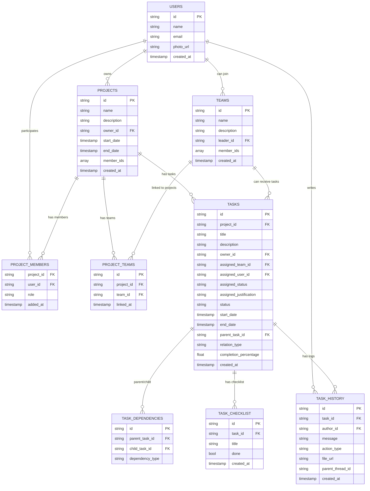

# Kanbatask - Estrutura de Banco de Dados e Integração com Flutter + Firestore

Este documento descreve toda a estrutura planejada para o **Kanbatask**, incluindo o modelo de dados no **Firestore**, regras de segurança, cache offline e exemplos práticos em Flutter. Também contém um **diagrama Mermaid** para visualização e um **passo a passo** de implementação.

---

## ✨ Objetivo

- Aplicativo baseado em **projetos**
- Cada projeto tem **membros** e **equipes**
- **Equipes** podem estar em vários projetos
- **Tarefas** atribuídas a equipes ou usuários com aceite/recusa
- **Histórico de tarefas** estilo Slack com threads e anexos
- **Checklist** com percentual de conclusão
- **Relacionamentos pai/filho** entre tarefas (dependências)
- **Permissões granulares** via Firestore Security Rules
- **Funcionamento offline** com cache local

---

## 🔗 Estrutura do Firestore

### 1. Users (`/users/{userId}`)
```json
{
  "name": "string",
  "email": "string",
  "photo_url": "string",
  "created_at": "timestamp"
}
```

### 2. Projects (`/projects/{projectId}`)
```json
{
  "name": "string",
  "description": "string",
  "owner_id": "userId",
  "start_date": "timestamp",
  "end_date": "timestamp",
  "member_ids": ["userId1", "userId2"],
  "created_at": "timestamp"
}
```
Subcoleção `members` para roles:
```json
/projects/{projectId}/members/{userId}
{
  "role": "owner|editor|viewer",
  "added_at": "timestamp"
}
```

### 3. Teams (`/teams/{teamId}`)
```json
{
  "name": "string",
  "description": "string",
  "leader_id": "userId",
  "member_ids": ["userId1", "userId2"],
  "created_at": "timestamp"
}
```

Tabela intermediária `project_teams` para vincular equipes a projetos:
```json
/project_teams/{id}
{
  "project_id": "projectId",
  "team_id": "teamId",
  "linked_at": "timestamp"
}
```

### 4. Tasks (`/tasks/{taskId}`)
```json
{
  "project_id": "projectId",
  "title": "string",
  "description": "string",
  "owner_id": "userId",
  "assigned_team_id": "teamId|null",
  "assigned_user_id": "userId|null",
  "assigned_status": "pending|accepted|rejected",
  "assigned_justification": "string|null",
  "start_date": "timestamp",
  "end_date": "timestamp",
  "status": "não iniciada|em andamento|cancelada|concluída|finalizada|bloqueada|pausada",
  "parent_task_id": "taskId|null",
  "relation_type": "simples|dependente",
  "completion_percentage": 0,
  "created_at": "timestamp"
}
```

### 5. Task Dependencies (`/task_dependencies/{id}`)
```json
{
  "parent_task_id": "taskId",
  "child_task_id": "taskId",
  "dependency_type": "simples|bloqueante"
}
```

### 6. Task Checklist (`/tasks/{taskId}/checklist/{itemId}`)
```json
{
  "title": "string",
  "done": false,
  "created_at": "timestamp"
}
```

### 7. Task History (`/tasks/{taskId}/history/{historyId}`)
```json
{
  "author_id": "userId",
  "message": "string",
  "action_type": "comment|status_change|assignment|file_upload",
  "file_url": "string|null",
  "parent_thread_id": "historyId|null",
  "created_at": "timestamp"
}
```

---

## 👀 Security Rules (resumo)

- Usuário **só pode ver projetos dos quais faz parte** (`member_ids`)
- Apenas **owner** pode deletar ou transferir projeto
- Apenas **líder da equipe** aceita/recusa tarefa atribuída ao time
- Apenas **usuário atribuido** aceita/recusa para si
- Apenas **membros do projeto** podem criar/editar tarefas

Exemplo:
```javascript
match /projects/{projectId} {
  allow read: if request.auth.uid in resource.data.member_ids;
  allow update, create: if request.auth.uid in resource.data.member_ids;
  allow delete: if request.auth.uid == resource.data.owner_id;
}

match /tasks/{taskId} {
  allow read: if request.auth.uid in get(/databases/$(database)/documents/projects/$(resource.data.project_id)).data.member_ids;
}
```

---

## 🛠️ Cache Offline

- Firestore **mantém cache local automaticamente**
- Permite **leitura offline** de dados já sincronizados
- Alterações offline são **enfileiradas e sincronizadas** ao reconectar

Para forçar cache:
```dart
await FirebaseFirestore.instance.settings = const Settings(
  persistenceEnabled: true,
);
```

---

## 📄 Diagrama Mermaid



---

## ✅ Checklist de Implementação

- [ ] Configurar coleções no Firestore (`users`, `projects`, `teams`, `tasks`, `task_dependencies`)
- [ ] Criar serviço Flutter para CRUD de **Projetos e Membros**
- [ ] Criar serviço Flutter para CRUD de **Equipes e vinculação a Projetos**
- [ ] Criar serviço Flutter para CRUD de **Tarefas com aceite/recusa**
- [ ] Implementar **Histórico de tarefas (mensagens e threads)**
- [ ] Implementar **Checklist de tarefas com cálculo de % concluída**
- [ ] Implementar dependências **Pai/Filho entre tarefas**
- [ ] Adicionar **Firestore Security Rules**
- [ ] Testar permissões de acesso (membros, líder, owner)
- [ ] Configurar e testar **modo offline e sincronização**
- [ ] (Opcional) Adicionar **Cloud Functions** para automações e notificações

Quando concluir cada etapa, marque ✅ substituindo `[ ]` por `[x]`.

---

📌 **Próximos passos imediatos:**

1. Criar serviço no Flutter para **Projetos e Membros**
2. Criar serviço para **Equipes e vinculação a Projetos**
3. Criar serviço para **Tarefas com aceite/recusa**
4. Implementar **Histórico e Checklist**
5. Adicionar **Security Rules** e testar
6. Testar **modo offline**
